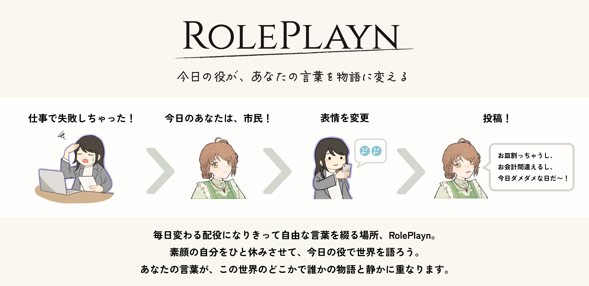
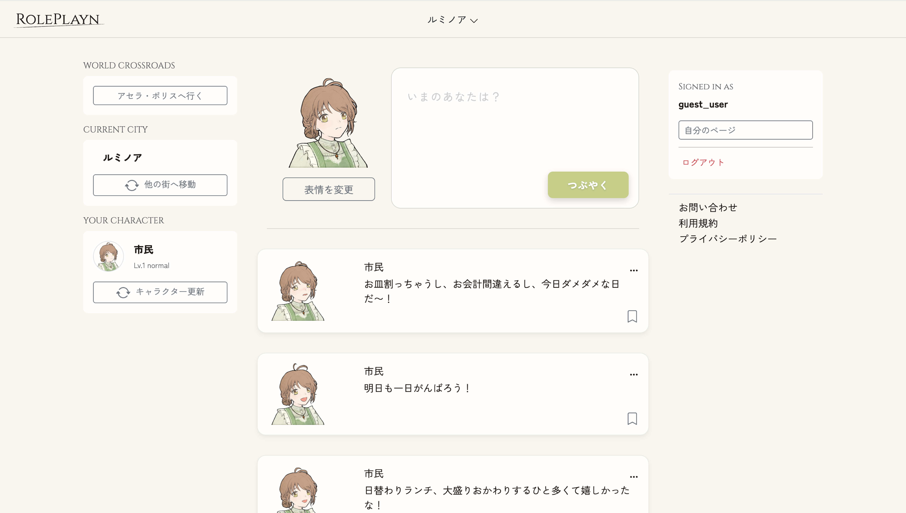
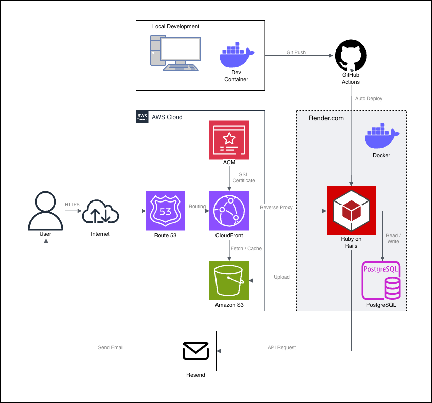
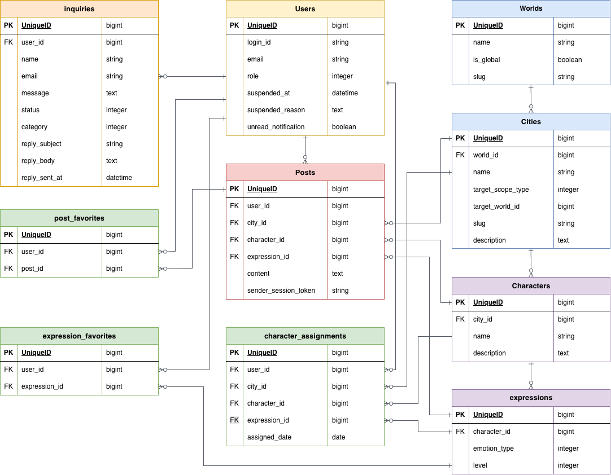

# RolePlayn

**「誰でもない誰かとして語る、ナラティブSNS」**

このアプリは、物語の世界に紛れ込んで今の自分を呟けるロールプレイ型SNSです。

その日その時ランダムに贈られる「配役（キャラクター）」を演じることで、日常のひとことも、創作のセリフも、キャラクターの言葉として自由に綴ることができます。
キャラクターに気持ちを託したつぶやきが、誰かの物語と静かに共鳴する。
「日常と非日常が重なる対話」を支えるために設計された、**新しい形のSNSプラットフォームです。**

## サービスURL

**[https://roleplayn.com](https://roleplayn.com)**
※ ゲストユーザー・ゲストモデレーターとして、登録なしですぐにログイン可能です。

## 画面イメージ

  
  

## 開発背景

> スマートフォンのメモ帳に物語のセリフを一節書き留めることで、気持ちが落ち着く瞬間があります。「SNSに今の思いを吐き出したいけれど、固定された名前やIDに縛られない匿名の場所が欲しい」。そんな願いを形にするために辿り着いたのが、日常の延長で気軽に「演じる」ことができるロールプレイ型SNSでした。

自分の気持ちをキャラクターの言葉として表現することで、心が安らぐ。その経験がきっと誰かの一助になると信じ、ライトにロールプレイを楽しめるプラットフォームとして本作の開発をスタートしました。

本作には、2つの思いを込めています。

**創作力のトレーニング**  
ランダムに割り当てられたキャラクターの日常やセリフを考えることで、発想力や表現力を気軽に試せる場を目指しました。

**感情のデトックス**  
現代のSNSでは、投稿に対する周囲の反応を気にしがちです。しかし、キャラクターというフィルターを通すことで、自分自身としては言いづらい本音や弱音を吐き出しやすくなります。嬉しいことも、悲しい出来事も、キャラクターに語ってもらうことで感情を分かち合う。ロールプレイを通した日常が、いつもの日常より優しく見えたら——そんな願いを込めて開発に取り組んでいます。

## 主な機能

### 1. 没入感を高める「世界 ＞ 街」構造

投稿を「街（City）」単位でカプセル化。毎日変わる街の風景や、シャッフル機能による予期せぬ出会いが、ユーザーの想像力を刺激します。

### 2. 配役システム

「1つの街に1人のキャラクター」の原則を守るため、閲覧都市ごとの配役状態を厳密に管理しています。

- **技術的工夫**: ログイン時はDB、未ログイン時はセッションへ保存先を動的に切り替え、ゲストでも会員同様の状態維持を実現しました。

### 3. ゲスト参加機能とログイン機能

利用者の目的に合わせ、セッション管理と認証基盤を使い分けることで、シームレスな導入と継続的な利用を支援しています。

| 区分                     | 役割と体験                     | 実装の工夫                                                                                                        |
| :----------------------- | :----------------------------- | :---------------------------------------------------------------------------------------------------------------- |
| **ゲスト（非ログイン）** | **「今すぐ、匿名で」**         | 会員登録の心理的ハードルを排除。セッショントークンによる一時的な投稿管理により、即時の体験を可能にしました。      |
| **認証ユーザー**         | **「物語の蓄積」と「利便性」** | **Devise** を採用し、メールアドレスのみで登録完了。過去投稿の非公開閲覧や、お気に入りの表情保存機能を解放します。 |

### 4. 没入感を守る「引き算」のデザイン

ロールプレイという繊細な体験を守るため、一般的なSNSの機能をあえて制限し、数値や他者の評価から解放された空間を設計しました。

- **リプライ機能の排除**:
  特定のユーザー間でのクローズドな対話や「返信しなければならない」という義務感を防ぐため、直接的な返信機能を撤廃。誰かの独り言が、また別の誰かの独り言と緩やかに共鳴するような、付かず離れずの距離感を保っています。

- **数値による評価の不可視化**:
  「いいね数」や「通知件数（バッジ）」などの数字をあえて表示しないUIを採用。承認欲求や焦燥感を煽る要素を排除し、ユーザーが自分のペースで純粋に物語に没頭できる環境を構築しました。

## 技術スタック

| カテゴリ              | 使用技術                                               |
| :-------------------- | :----------------------------------------------------- |
| **バックエンド**      | Ruby on Rails 7.2.3                                    |
| **フロントエンド**    | Hotwire (Turbo/Stimulus), Bootstrap 5 (dartsass-rails) |
| **言語**              | Ruby 3.3.10                                            |
| **データベース**      | PostgreSQL                                             |
| **インフラ**          | Docker / AWS (Route 53, ACM)                           |
| **認証**              | Devise                                                 |
| **ストレージ / CDN**  | Active Storage (AWS S3 + CloudFront)                   |
| **ホスティング**      | Render                                                 |
| **CI / CD**           | GitHub Actions                                         |
| **テスト / 静的解析** | RSpec / RuboCop / Stylelint / Prettier                 |
| **メール配信**        | Resend                                                 |

## 設計のこだわりと技術選定

**「開発スピード」と「将来の拡張性」の両立** をテーマに設計しました。

### 1. インフラ：ポータビリティ重視のコンテナ戦略

将来的な **AWS (ECS/EKS)** への移行を見据え、開発から本番まで **Docker** で統一。プラットフォームに依存しない「疎結合な設計」を徹底しています。

### 2. フロントエンド：Node.js 非依存のビルド構成

Rails 7.2 / 8 の思想に合わせ、**No-Node 構成**（`importmap-rails`, `dartsass-rails`）を採用。

- **メリット**: ビルドの複雑さを排除し、本番コンテナの軽量化とデプロイ速度の向上を実現しました。

### 3. バックエンド：Rails標準の設計思想を尊重した開発

本プロジェクトの核心である「ユーザーの没入感を支える機能」を、最も迅速かつ堅牢に実装できると判断したため Ruby on Railsを採用しました。

Rails特有の規約に基づいた開発により、認証やDB管理などの基盤構築を最小限の工数で抑え、独自の配役ロジックの実装に注力しました。

## アーキテクチャ

### インフラ構成図

> **「運用のシンプルさと配信の堅牢性」**
> アプリ基盤には運用コストの低い Render を、画像配信には AWS S3 + CloudFront を採用。低遅延かつセキュアな配信環境を構築しました。

### ER図

> **「世界観を守る複合制約」**
> 「User / City / Date」の複合ユニーク制約により、システムレベルで「重複のない配役」を保証。データの整合性と柔軟なゲスト機能を両立した設計です。

## 今後の展望

- **インフラ強化**: RenderからAWSへの完全移行による将来の利用者増や負荷の増大にも柔軟に対応できる拡張性の確保。
- **品質管理**: Sentry導入によるエラー監視と、問い合わせ機能（Inquiries）と連動したモデレーション体制の構築。
- **技術的挑戦**: 学習コストを考慮して見送った React / Tailwind CSS の導入再検討による、UI表現力の向上。

現在はRailsの設計思想を深く理解することを優先しましたが、React導入など継続的な技術挑戦を通じてサービスを育てていきたいと考えています。
